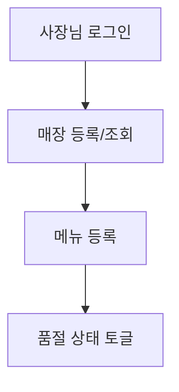
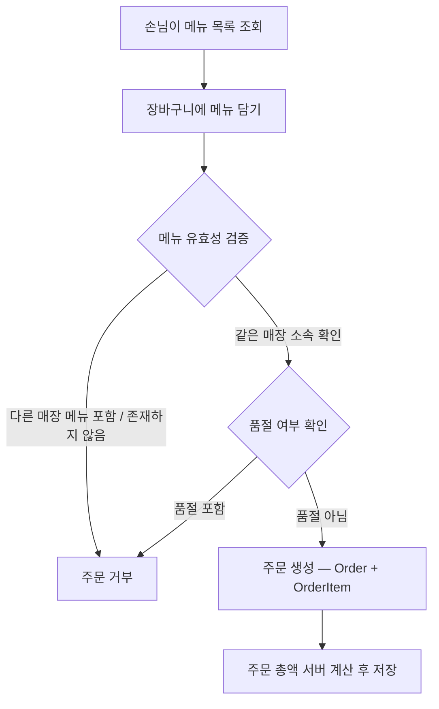
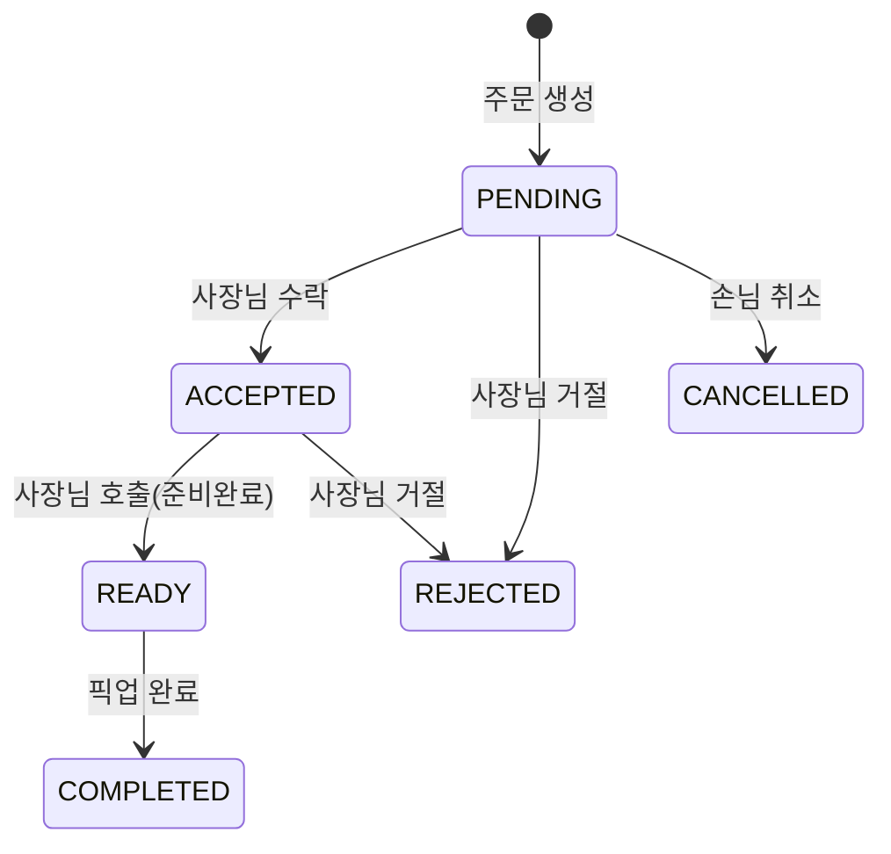
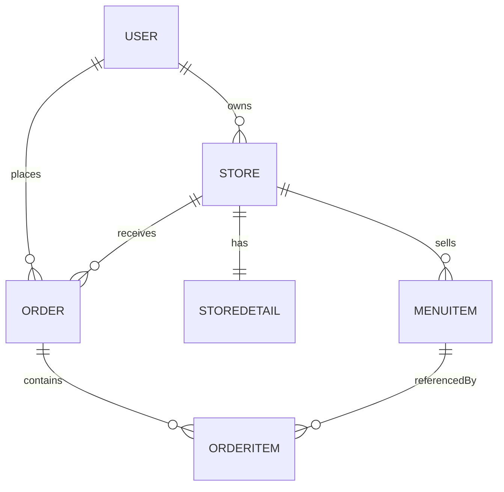

# 도메인 설계서 — 소상공인 예약/주문 관리 앱

## 문서 정보

- **프로젝트명**: 소상공인 예약/주문 관리 앱 (Rookies_MiniProject2)
- **작성자**: 3조 — 손인선 (Part B — 메뉴/주문 도메인)
- **작성일**: 2026-10-01 (최초 작성 2026-09-28, 이후 구현된 상태 머신/권한 변경사항 반영 개정)
- **버전**: v2.0

---

## 1. 프로젝트 개요

### 1.1 프로젝트 목적

소규모 매장(카페, 분식점, 베이커리 등) 사장님들이 고객에게 온라인 메뉴 주문과 픽업 예약 서비스를 제공할 수 있도록 돕는 주문 관리 서비스.

### 1.2 프로젝트 범위

- 회원/인증: JWT, `USER`/`OWNER`/`ADMIN` 역할을 가진 통합 `User` 객체
- 매장 등록/관리: 기본 정보(`Store`), 영업시간(`StoreDetail`, 1:1), 소프트 삭제
- 메뉴 등록·조회·수정·품절 처리, 소프트 삭제
- 주문 생성: 장바구니(메뉴 ID 목록) 검증, 서버 측 금액 계산
- 주문 상태 관리: 접수대기 → 수락 → 준비완료 → 픽업완료 (+ 거절/취소 분기)

### 1.3 이해관계자

| 구분 | 역할 | 주요 관심사 |
|---|---|---|
| 손님(USER) | 서비스 이용자 | 메뉴 탐색, 간편한 주문, 주문 상태 확인/취소 |
| 사장님(OWNER) | 매장 운영자 | 매장/메뉴 등록 및 품절 관리, 주문 접수·처리 |
| 관리자(ADMIN) | 운영 관리자 | 전체 회원 목록 관리 (`GET /api/users`) |
| 시스템 관리 | 인프라/보안 | 인증, 데이터 무결성, 안정성 |

---

## 2. 비즈니스 도메인

### 2.1 핵심 프로세스

#### 2.1.1 매장/메뉴 관리

- 매장 기본 정보(`Store`)와 영업시간(`StoreDetail`)을 1:1로 분리해 관리.
- 메뉴·매장·회원 모두 하드 삭제 대신 소프트 삭제(`deleted_at`)로 처리 — 주문 이력이 과거 메뉴/매장/회원을 참조하기 때문.

#### 2.1.2 주문 생성

- 손님이 요청한 메뉴 ID가 모두 "같은 매장 소속"이면서 "존재하는 메뉴"인지 한 번에 검증 (`menuItemRepository.findAllByIdAndStoreId`로 조회된 개수와 요청 개수를 비교).
- 주문 총액은 클라이언트 값을 신뢰하지 않고, 서버가 주문 항목(수량 × 메뉴 단가)을 합산해 계산.

#### 2.1.3 주문 상태 전이

> `Order` 엔티티(`menu/entity/Order.java`)가 상태 전이 규칙을 직접 소유한다 (리치 도메인 모델 — 서비스 계층이 아니라 엔티티 메서드가 검증).
> - `accept()`: `PENDING → ACCEPTED`만 허용
> - `ready()`: `ACCEPTED → READY`만 허용
> - `complete()`: `READY → COMPLETED`만 허용
> - `reject()`: **`PENDING` 또는 `ACCEPTED`**에서 `REJECTED`로 (준비가 끝난 `READY` 상태에서는 거절 불가)
> - `customerCancel()`: `PENDING`에서만 `CANCELLED`로 (손님 전용, 조리 시작 후에는 취소 불가)
>
> 기대 상태가 아닌 전이를 시도하면 `BusinessException(INVALID_ORDER_STATUS)` → 409.

### 2.2 비즈니스 이벤트

| 이벤트 | 트리거 | 결과 |
|---|---|---|
| 회원가입 | 손님/사장님 | `User` 저장 (가입 시 `ADMIN` 자가 선택은 서버가 차단) |
| 매장 등록 | 사장님 | `Store`(+선택적으로 `StoreDetail`) 저장 |
| 메뉴 등록 | 사장님 | `MenuItem` 저장 (매장 내 이름 중복 시 거부) |
| 품절 토글 | 사장님 | `MenuItem.soldOut` 반전 |
| 주문 생성 | 손님 | `Order`(PENDING) + `OrderItem` 목록 저장, 총액 계산 |
| 주문 수락 | 사장님 | `Order.status` → `ACCEPTED` |
| 주문 호출(준비완료) | 사장님 | `Order.status` → `READY` |
| 픽업 완료 | 사장님 | `Order.status` → `COMPLETED` |
| 주문 거절 | 사장님 | `Order.status` → `REJECTED` |
| 주문 취소 | 손님 | `Order.status` → `CANCELLED` (PENDING에서만) |
| 매장/메뉴/회원 삭제 | 사장님/손님 | `deletedAt` 기록 (소프트 삭제) |

---

## 3. 핵심 도메인 객체

### 3.1 식별

| 객체 | 유형 | 담당 파트 | 설명 |
|---|---|---|---|
| User | Entity | A | 회원 (손님/사장님/관리자 통합 계정) |
| Store | Entity | A | 매장 기본 정보 |
| StoreDetail | Entity | A | 매장 영업시간 (Store와 1:1) |
| MenuItem | Entity | B | 매장이 판매하는 메뉴 |
| Order | Entity | B(생성) / C(상태 전이) | 주문 |
| OrderItem | Entity | B | 주문에 담긴 메뉴별 항목 (장바구니 스냅샷) |

### 3.2 요약 속성/규칙

- **User**: id, email(UK), password(해시), name, phone, role(`USER`/`OWNER`/`ADMIN`), deletedAt(소프트 삭제)
- **Store**: id, owner(User FK), name, address, category, imageUrl, deletedAt
- **StoreDetail**: id, store(FK, 1:1 UNIQUE), openTime, closeTime
- **MenuItem**: id, store(FK), name, price, soldOut, imageUrl, deletedAt
- **Order**: id, customer(User FK), store(FK), status(`PENDING`/`ACCEPTED`/`READY`/`COMPLETED`/`REJECTED`/`CANCELLED`), totalAmount(주문 시점 스냅샷 합계), pickupTime, requestNotes
- **OrderItem**: id, order(FK), menuItem(FK), quantity, orderPrice(주문 시점 메뉴 단가 스냅샷)

---

## 4. 도메인 관계도

---

## 5. 비즈니스 규칙

- 품절(`soldOut = true`) 상태인 메뉴는 주문에 포함될 수 없다.
- 하나의 주문에는 동일한 매장의 메뉴만 담을 수 있으며, 존재하지 않는 메뉴 ID나 다른 매장 소속 메뉴가 섞여 있으면 주문 자체를 거부한다 (`INVALID_STORE_MENU_OR_NOT_FOUND`).
- 주문 총액은 클라이언트가 아닌 서버가 주문 항목(수량 × 메뉴 단가)을 기준으로 계산한다 (가격 조작 방지).
- 주문 항목의 단가는 주문 생성 시점 메뉴 가격의 스냅샷이다. 이후 메뉴 가격이 바뀌어도 과거 주문 금액에는 영향을 주지 않는다.
- 주문 상태는 `PENDING → ACCEPTED → READY → COMPLETED` 순서로만 전진하며 역행·단계 건너뛰기는 불가하다. 단, 사장님은 `PENDING` 또는 `ACCEPTED`에서 `REJECTED`로 거절할 수 있고, 손님은 `PENDING`에서만 `CANCELLED`로 취소할 수 있다. 위반 시 409 (`INVALID_ORDER_STATUS`).
- 매장과 메뉴, 회원은 주문 이력이 참조하므로 하드 삭제하지 않고 `deleted_at`을 채우는 소프트 삭제로 처리한다.
- 매장 내 메뉴 이름은 중복 등록할 수 없다 (같은 매장 기준, 소프트 삭제된 메뉴는 제외하고 비교).
- 회원가입 시 `ADMIN` 역할은 선택할 수 없다 (서버가 차단, `INVALID_SIGNUP_ROLE`).
- 모든 리소스의 소유권 확인은 클라이언트가 보낸 id가 아니라 JWT 토큰에서 추출한 로그인 사용자(`@CurrentUser`)를 기준으로 서버가 직접 수행한다 (IDOR 방지).
- 픽업 시간(`pickupTime`)은 현재 손님이 주문 시 직접 입력하는 방식으로 구현되어 있으며, `@Future` 검증으로 과거 시간은 거부한다. (추후 매장이 접수 시점에 지정하는 방식으로 변경하는 것도 검토 가능)

---

## 6. 도메인 서비스

| 서비스 | 책임 |
|---|---|
| UserService | 회원가입/로그인/정보 조회·수정/탈퇴(소프트 삭제) |
| StoreService | 매장 등록/조회/수정/삭제, 영업시간 관리 |
| MenuService | 메뉴 등록/조회/수정/품절 토글/삭제 |
| OrderService (`menu.service`) | 주문 생성(메뉴 검증, 총액 계산), 매장별 주문 목록 조회 |
| CustomerOrderService | 손님 주문 목록/단건 조회, 취소 |
| OrderStatusService | 사장님의 주문 상태 전이(수락/거절/준비완료/픽업완료) |
| ImageUploadService | 메뉴 이미지 업로드 (MIME 화이트리스트 검증) |

---

## 7. 용어

- **소프트 삭제(deleted_at)**: 데이터를 실제로 지우지 않고 삭제 시각만 기록해 조회에서 제외하는 방식.
- **접수대기/수락/준비완료/픽업완료**: 각각 시스템 상태값 `PENDING`/`ACCEPTED`/`READY`/`COMPLETED`에 대응하는 사용자용 표현.
- **스냅샷(snapshot)**: 주문 생성 시점의 메뉴 가격을 `OrderItem.orderPrice`에 복사해 두어, 이후 메뉴 가격이 바뀌어도 과거 주문 금액을 그대로 보존하는 방식.

---

## 8. 가정 및 제약

- 기술 스택: Spring Boot 4.0, Spring Security 7.0(JWT), Spring Data JPA/Hibernate, MariaDB, JJWT 0.12.7.
- 보안: Bearer JWT, 역할 기반(`@PreAuthorize`) + 리소스 소유권 검증의 이중 구조. 연관관계는 `LAZY` 로딩 + DTO 변환으로 엔티티 직접 직렬화를 피한다.
- 결제 기능 없음 — 매장에서 직접 결제/픽업 수령을 전제로 한다.

---

## 9. 향후 확장

- 결제 연동
- 카테고리별 탐색/검색 고도화
- 즐겨찾기 기능
- 픽업 시간을 매장이 접수 시점에 지정하는 방식으로 변경

---

## 10. 검토 및 승인

| 버전 | 검토자 | 검토일 | 주요 변경사항 |
|---|---|---|---|
| v1.0 | 손인선 | 2026-09-28 | 초안 작성 (PENDING/ACCEPTED/COMPLETED 3단계로만 기술) |
| v2.0 | 손인선 | 2026-10-01 | every moment 팀 양식으로 전면 개편. 실제 `Order` 엔티티 코드 기준으로 상태 머신에 `READY`/`REJECTED`/`CANCELLED` 반영(초안 누락분 보정), `ADMIN` 역할 및 전 도메인 소프트 삭제 범위 반영 |
